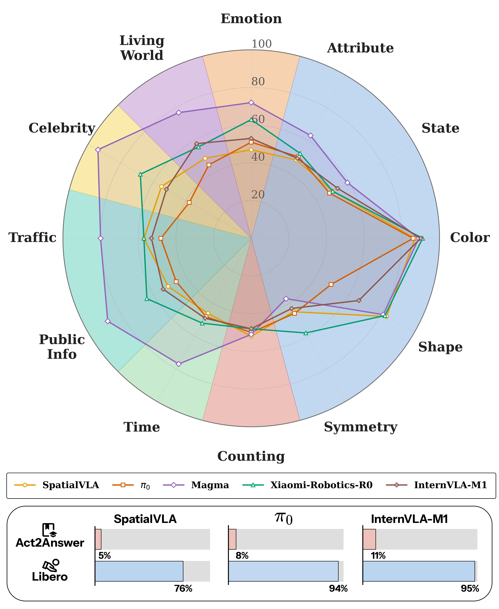

<div align="center">

# Does VLA Even Know the Basics?
### Measuring Commonsense and World Knowledge Retention in Vision-Language-Action Models

[Project Page](https://tttonyalpha.github.io/act2answer/) | [Paper](https://tttonyalpha.github.io/act2answer/) | [License](LICENSE)

</div>

<p align="center"></p>

**Act2Answer** is an embodied evaluation protocol for Vision-Language-Action (VLA) models. Each
question becomes a short tabletop episode: the model reads a natural-language instruction and answers
by placing a cube on the image tile it believes is correct. This keeps the motor problem simple, so
failures are informative about knowledge that is missing or not usable for action selection.

The release benchmark uses one ManiSkill environment: `Act2AnswerV4-v1`.

## Quick Start From Scratch

Prerequisites: Linux, NVIDIA GPU/CUDA, `git`, and conda or Miniconda. If you use Hugging Face gated
or rate-limited weights, run `huggingface-cli login` before the first model download.

```bash
git clone <this-repo-url> Act2Answer
cd Act2Answer

# Clone the external model repos next to Act2Answer.
bash scripts/setup/clone_external_repos.sh

# Build one in-process model env from scratch.
bash scripts/setup/setup_spatialvla_env.sh

# Run both noswap and swap; videos/stats go to outputs/, logs go to logs/.
ASSETS=test_colors COUNT=6 EVAL_GPU=3 bash scripts/eval_spatialvla.sh
```

Full setup for all models is in [SETUP_README.md](SETUP_README.md).

## Running Evaluations

Every eval wrapper sources `scripts/env.sh`, activates the expected conda env, runs both `noswap` and
`swap`, and writes `FINAL_STATS` to `$A2A_LOG_DIR/<model>_<asset>_eval.log`.

In-process models:

```bash
ASSETS=test_colors COUNT=6 EVAL_GPU=3 bash scripts/eval_pi0.sh
ASSETS=test_colors COUNT=6 EVAL_GPU=3 bash scripts/eval_magma.sh
ASSETS=test_colors COUNT=6 EVAL_GPU=3 bash scripts/eval_openvla.sh
ASSETS=test_colors COUNT=6 EVAL_GPU=3 bash scripts/eval_spatialvla.sh
```

Server-based models need their policy server first:

```bash
GPU=0 bash scripts/servers/run_xiaomi_policy_server.sh
ASSETS=test_colors COUNT=6 EVAL_GPU=3 bash scripts/eval_xiaomi.sh
```

Available eval wrappers:

| VLA | Script | Env |
|-----|--------|-----|
| pi0 | `scripts/eval_pi0.sh` | `pi0_act2answer` |
| Magma | `scripts/eval_magma.sh` | `magma_act2answer` |
| OpenVLA | `scripts/eval_openvla.sh` | `openvla_rl4vla` |
| SpatialVLA | `scripts/eval_spatialvla.sh` | `spatialvla_act2answer` |
| Xiaomi-Robotics-0 | `scripts/eval_xiaomi.sh` | server `mibot`, client `act2ans` |
| InternVLA-M1 | `scripts/eval_internvla.sh` | server `internvla`, client `act2ans` |
| MolmoAct2 | `scripts/eval_molmoact.sh` | server `molmoact2`, client `act2ans` |

Outputs:

- Videos and per-run YAML: `$A2A_OUTPUT_DIR/<run-name>/glob/` (default `outputs/`).
- Logs: `$A2A_LOG_DIR/` (default `logs/`).
- No wandb init, runs, or artifacts are created by evaluation.

## Assets

Act2Answer assets live under `ManiSkill/mani_skill/assets/carrot/<asset_name>/`. Each asset set
contains `pairs.json`, tile models/textures, and metadata. 

Use `ASSETS=<asset_name>` and `COUNT=<n>` to select an evaluation slice. `COUNT=0` means all tasks.

## Citation

```bibtex
@article{act2answer2026,
  title   = {Does VLA Even Know the Basics? Measuring Commonsense and World Knowledge
             Retention in Vision-Language-Action Models},
  author  = {Kachaev, Nikita and Moskalenko, Andrey and Skripkin, Matvey and Kurlaev, Nikita
             and Pugacheva, Daria and Burlova, Albina and Kolosov, Mikhail and Shepelev, Denis
             and Kuznetsov, Andrey and Tutubalina, Elena and Panov, Aleksandr I.
             and Kovalev, Alexey K. and Shakhuro, Vlad},
  year    = {2026},
  url     = {https://tttonyalpha.github.io/act2answer/}
}
```

## Acknowledgements

Built on [SimplerEnv](https://github.com/simpler-env/SimplerEnv) and
[ManiSkill](https://github.com/haosulab/ManiSkill), with evaluation harness pieces derived from
[RL4VLA](https://github.com/gen-robot/RL4VLA).
